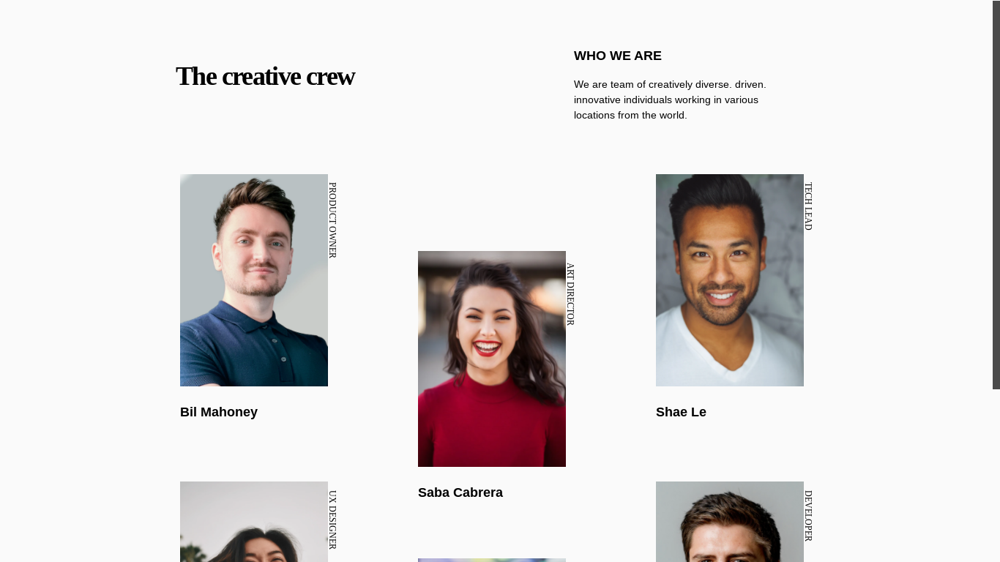
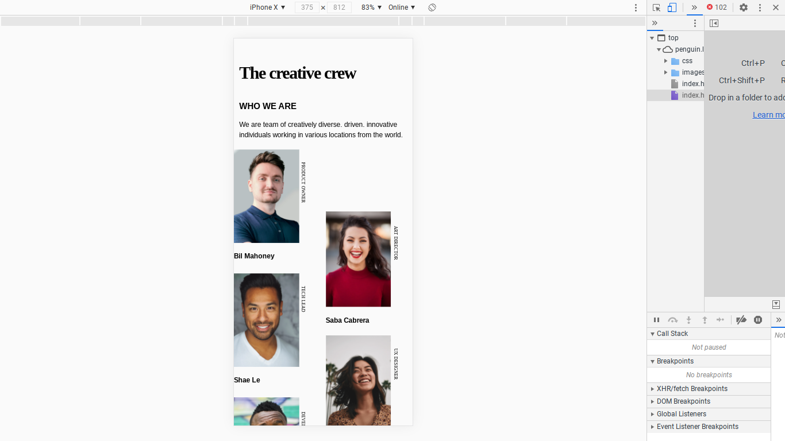

<h1 align="center">{Team Page}</h1>

   Solution for a challenge from  <a href="http://devchallenges.io" target="_blank">Devchallenges.io</a>.

  <h3>
    <a href="https://{your-demo-link.your-domain}">
      Demo
    </a>
     | 
    <a href="https://{https://github.com/Queen-codes/Team-page}">
      Solution
    </a>
     | 
    <a href="https://devchallenges.io/challenges/hhmesazsqgKXrTkYkt0U">
      Challenge
    </a>
  </h3>

## Table of Contents

- [Overview](#overview)
  - [Built With](#built-with)

- [Contact](#contact)
- [Acknowledgements](#acknowledgements)

## Overview

### Built With

- [HTML]
- [CSS]
- 

## Features

This application/site was created as a submission to a [DevChallenges](https://devchallenges.io/challenges) challenge. The [challenge](https://devchallenges.io/challenges/hhmesazsqgKXrTkYkt0U) was to build an application to complete the given user stories.

## Acknowledgements

- [Steps to replicate a design with only HTML and CSS](https://devchallenges-blogs.web.app/how-to-replicate-design/)

- [Marked - a markdown parser](https://github.com/chjj/marked)

## Contact

- GitHub [@Queen-codes](https://github.com)
- Twitter [@i_Queeening](https://twitter.com/i_Queeening)
